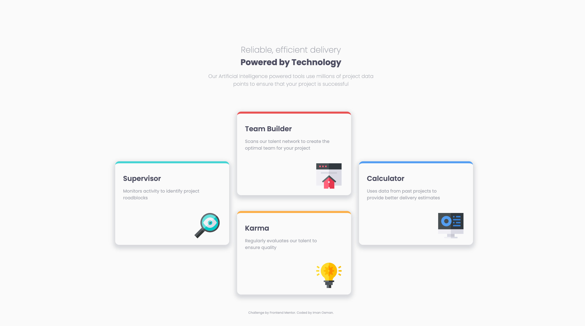

# Frontend Mentor - Four card feature section solution

This is a solution to the [Four card feature section challenge on Frontend Mentor](https://www.frontendmentor.io/challenges/four-card-feature-section-weK1eFYK).

## Table of contents

- [Overview](#overview)
- [The task](#the-task)
- [Approach](#approach)
- [Outcome](#outcome)
- [My process](#my-process)
- [Built with](#built-with)
- [Feedback](#feedback)
- [Lessons](#lessons)
- [Take forward](#take-forward)
- [Useful resources](#useful-resources)

## Overview

This challenge is to create a four-card feature page for both mobile and desktop. The page includes a header, with a 3-column layout, where cards are aligned at different positions creating a plus-like cross on the page.

## The task

This design needs to be responsive.

## Approach

I approached this with a mobile-first workflow to practice this some more. I initially began with a Flexbox 3-column layout before having to switch it to Grid in the Desktop version. Once I did, this offered me much much more control.

## Outcome

I'm happy with the final design, but I'd like to gain confidence in knowing how to tackle problems with less detours, but I know this will come with practice and time. The design I made is fluid, accurate and works well. I'm happy with the code I wrote. I'd like to learn how to use Sass fully.




:jigsaw: Live Site URL: (https://i000o.github.io/four-card-feature/)  
:pencil2: Solution URL: (https://www.frontendmentor.io/solutions/four-card-feature-grid-mobile-first-kTo-3mdrwy)

## My process

### CSS Flexbox

- I started with a mobile first approach to practice this workflow as I've tended to be more comfortable with the desktop-first workflow previously.
- I wrote down and planned on paper a little the HTML elements I could see/would use. I decided to plan a Flexbox layout with CSS since I had recently practiced this on a deeper level and felt more confident - I wanted to apply this into a project.
- I initialised a new git repository from the command line with ease this time!
- I was able to implement the `order` property for the first time for the mobile version. Since I had planned my 3-column flex layout, each card had a left-to-right order in the HTML until I was able to rearrange it in the CSS for mobile. This was really satisfying and so useful to be able to depend on now.
- I noticed that I'm getting better at linking images quickly.
- I finished the mobile so much faster than I thought I would - I was proud. It looked good and I did it quite efficiently.
- I mistakenly started with 425px first in my media queries. Now I know to always start with the smallest viewport and use `min-width` in media queries from there.
- Flexbox was not working well on my desktop design. The content was overflowing and I didn't know what code to write to help it shrink. I wanted to use `flex-shrink` and `flex-basis` but wasn't sure which basis to set to allow proportionate shrinking. I also didn't know what, if any, `width`/`min-width`/`max-width` properties to use because the content seemed to default to overflow. I tried many options with no luck, including `overflow` and `gap`. I felt no control over my layout at this point, so I want to try Grid instead. I wondered how I could have anticipated this sooner to save myself time and work.

### Sass

- I downloaded Sass as a pre-processor, but was initially unclear as to how to use it.
- I learnt a new Sass command:

```
sass input.scss output.css
```

- Sass! I installed Sass syntax highlighting and the compiler to try Sass with this CSS file. I can create modules, nesting and variables to help sustian my code better.
- I wrote in some Sass with modules, nesting and variables, but once I used the Watch Sass button on VSCode, it stayed on Watching... forever. It also craeted an `input.css` as a result which I didn't ask for. I had programmed `sass input.scss output.css` so I don't know why it did this. I abandoned it for now, but will try again because I like the idea of Sass and I'd like to use it in my code as CSS files get more complex and long.

### Git

- I learnt new Git commands:

To remove a github repo file if you didn’t add it to the gitignore at the beginning.

```
git rm —cached file-name
git commit -m “removed file-name”
git push
```

This removes it from the repo but not locally. If you want to remove it altogether, use:

```
git rm file-name
```

If you did that by accident, use:

```
git checkout HEAD — filename
```

### CSS Grid

- I did some research to refresh me on Grid. One article in particular helped me to differentiate it from Flexbox in my mind before starting (linked).
- I reassured myself that changing the Desktop layout from Flex to Grid would be easy, and it was, thankfully. I arranged the Grid to add columns as the viewport widened.

## Time taken :alarm_clock:

- Mobile: 3 hrs
- Desktop: 3.5 on Flexbox before realising I needed to ditch it, 1hr on Grid which worked better.

### Built with

- Semantic HTML5 markup
- CSS custom properties
- CSS Grid
- Mobile-first workflow

## Feedback

## Lessons

1. `order` property implementation - So useful, I love not messing with my HTML
2. New Git commands `git rm`
3. Sass - I learnt some early syntax and implemented some modules, variables and nesting in my CSS but failed to succeed in compiling. I'll try again.
4. Grid `place-content` shorthand
5. I learnt and understood more about `.gitignore`

## Take forward

:grey_exclamation: I feel more comfortable writing media queries now  
:grey_exclamation: I'd like to practice more Sass compiling  
:grey_exclamation: I'd like to practice more Flexbox and Grid  
:grey_exclamation: I enjoy writing README's  
:grey_exclamation: Markdown  
:grey_exclamation: I work relatively fast

## Useful resources

- [Learn Sass](https://sass-lang.com/guide/) - Help me with introductory Sass syntax.
- [W3C Sass](https://www.w3schools.com/sass/sass_intro.asp) - Extended knowledge on Sass.
- [Grid] (https://www.joshwcomeau.com/css/interactive-guide-to-grid/) - More in-depth dynamic article on CSS Grid.
